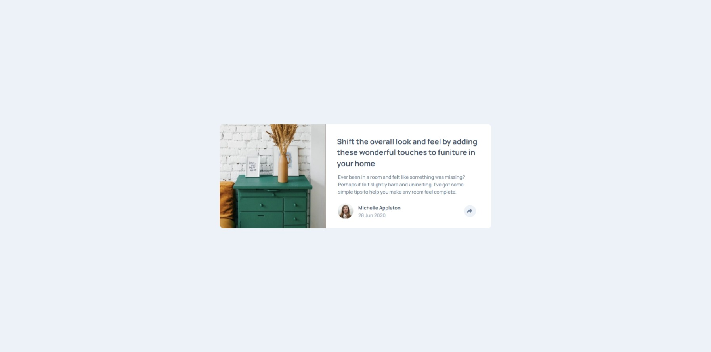

# Frontend Mentor - Article preview component solution

This is a solution to the [Article preview component challenge on Frontend Mentor](https://www.frontendmentor.io/challenges/article-preview-component-dYBN_pYFT). Frontend Mentor challenges help you improve your coding skills by building realistic projects. 

## Table of contents

- [Overview](#overview)
  - [The challenge](#the-challenge)
  - [Screenshot](#screenshot)
  - [Links](#links)
- [My process](#my-process)
  - [Built with](#built-with)
  - [What I learned](#what-i-learned)
  - [Continued development](#continued-development)
  - [Useful resources](#useful-resources)
  - [AI Collaboration](#ai-collaboration)
- [Author](#author)
- [Acknowledgments](#acknowledgments)

**Note: Delete this note and update the table of contents based on what sections you keep.**

## Overview

### Screenshot



### Links

- Solution URL: [FrontEnd Mentor Solution](https://www.frontendmentor.io/solutions/article-preview-component-SybymsmQZL)
- Live Site URL: [Article Preview Component Deployed Solution](https://osmond20.github.io/Article-Preview-Component/)

## My process

### Built with

- Semantic HTML5 markup
- CSS custom properties
- Flexbox
- CSS Grid
- Mobile-first workflow
- SASS

### What I learned

It was a growth opportunity to try practicing javascript with HTML & CSS as it did challenge me so grateful to have practiced to have gained experience with starting to use js in html & css code.

To see how you can add code snippets, see below:

```js
function toggleSharePanel() {
  if (!sharePanel || !shareButton) return;
  const isOpen = sharePanel.classList.toggle('show');
  shareButton.classList.toggle('share-open', isOpen);
  shareButton.setAttribute('aria-expanded', isOpen ? 'true' : 'false');
}

if (shareButton && closeButton && sharePanel) {
  shareButton.addEventListener('click', toggleSharePanel);
  closeButton.addEventListener('click', toggleSharePanel);
}
```

### Continued development

Will be focusing on building responsive designed solutions with js in the mix.

### AI Collaboration

Describe how you used AI tools (if any) during this project. This helps demonstrate your ability to work effectively with AI assistants.

- What tools did you use (e.g., ChatGPT, Claude, GitHub Copilot)? Github CoPilot
- How did you use them (e.g., debugging, generating boilerplate, brainstorming solutions)? Useful for debugging the solution and helping me understand how to js code is integrated with the html & css, and work to provide a fully functioning website that is interactive.

## Author

- Website - [GitHub](https://www.github.com/osmond20)
- Frontend Mentor - [@osmond20](https://www.frontendmentor.io/profile/osmond20)
